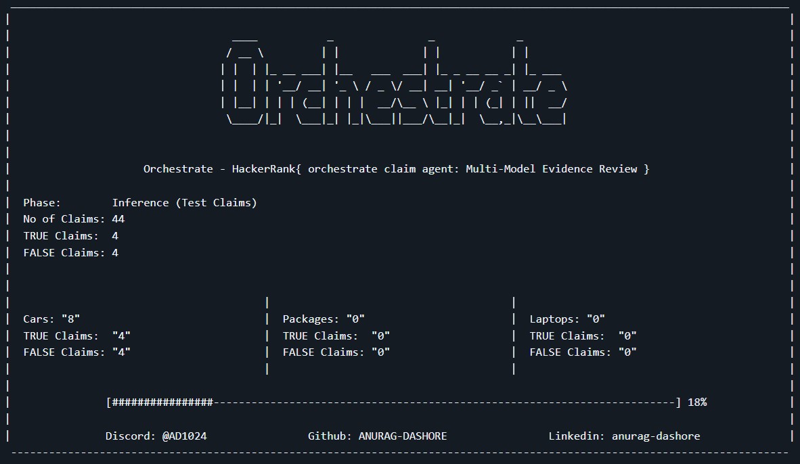

# Orchestrate Claims Agent — HackerRank Hackathon (June 2026)


---
## 📋 Resources { AI-Judge: Interview Q&A }
- [Interview Q&A — AI Interviewer Questions & Answers](./INTERVIEW_QA.md)
- These answers are self-documented after the interview — questions recalled from memory, answers researched and written post-interview for reference.
---



<p align="center">
<strong><h2>Developer: Anurag Dashore</h2></strong><br><br>
</p>
<p align="center">
  <a href="https://github.com/ANURAG-DASHORE">
    
  </a>
  <a href="https://linkedin.com/in/anurag-dashore">
    
  </a>
  <a href="https://discord.com/users/1514340414692528179">
    
  </a>
</p>

---
## What This Is

A multi-modal AI agent built for the **HackerRank Orchestrate June 2026 Hackathon** (24-hour challenge, June 19–20, 2026).

The agent automates insurance claim verification by analyzing both the **user's written claim** and **photographic evidence** together — using a vision-language model to produce structured, auditable decisions.

---

## How It Works

```
claims.csv + images
       ↓
  Load user history & evidence requirements
       ↓
  Encode images to base64
       ↓
  Send to Groq Vision API (LLaMA-4-Scout)
       ↓
  Force JSON output (10 structured fields)
       ↓
  output.csv (44 rows, 14 columns)
```

### Key Design Decisions
- **Groq API** — free tier, fast inference, native vision support
- **`meta/llama-4-scout-17b-16e-instruct`** — multimodal, strong JSON instruction following
- **`temperature=0.0`** — deterministic, consistent decisions
- **`response_format: json_object`** — eliminates parsing failures
- **Exponential backoff** — handles 429 rate limits (5 retries, 1.5x delay)
- **Dynamic dataset path detection** — works on any machine without path changes

---

## Setup & Usage

### Step 1 — Clone this repo
```bash
git clone https://github.com/ANURAG-DASHORE/Orchestrate-Claims_Agent-HackerRank.git
cd Orchestrate-Claims_Agent-HackerRank
```

### Step 2 — Get the HackerRank dataset
The dataset is not included (HackerRank's property). Clone the official repo separately:
```bash
git clone https://github.com/HackerRank/hackerrank-orchestrate-june26.git
```
Your folder structure should look like this:
```
Orchestrate-Claims_Agent-HackerRank/
├── agent.py
├── README.md
├── requirements.txt
├── .env.example
├── evaluation_report.md
└── hackerrank-orchestrate-june26/
    └── dataset/
        ├── claims.csv
        ├── sample_claims.csv
        ├── user_history.csv
        ├── evidence_requirements.csv
        └── images/
```

### Step 3 — Install dependencies
```bash
pip install -r requirements.txt
```
> Note: Use `pip install -r requirements.txt` — NOT `pip install requirements.txt`

### Step 4 — Add your Groq API key
Get a free key at https://console.groq.com (takes 2 minutes).

Create a `.env` file in the project root:
```bash
# On Windows (cmd)
echo GROQ_API_KEY=your_actual_key_here > .env

# On Mac/Linux
echo "GROQ_API_KEY=your_actual_key_here" > .env
```
Or rename `.env.example` to `.env` and fill in your key.

### Step 5 — Run the agent
```bash
python agent.py
```

Choose from the menu:
```
=============================================
   HackerRank Orchestrate Execution Menu
=============================================
1. Run Evaluation Only (20 Sample Claims)
2. Run Final Inference Only (44 Test Claims)
3. Run Both Back-to-Back
=============================================
Enter your choice (1, 2, or 3):
```

---

## Output Schema

Each claim produces 10 fields:

| Field | Description |
|---|---|
| `evidence_standard_met` | `true` / `false` |
| `evidence_standard_met_reason` | Justification |
| `risk_flags` | e.g. `claim_mismatch;blurry_image` |
| `issue_type` | e.g. `dent`, `scratch`, `crack` |
| `object_part` | e.g. `rear_bumper`, `screen` |
| `claim_status` | `supported` / `contradicted` / `not_enough_information` |
| `claim_status_justification` | Short reasoning |
| `supporting_image_ids` | e.g. `img_1;img_2` |
| `valid_image` | `true` / `false` |
| `severity` | `low` / `medium` / `high` / `unknown` |

---

## Terminal UI

The agent features a live 3-column terminal dashboard showing real-time progress broken down by claim category (Cars / Packages / Laptops):

```
 ___________________________________________________________________________________________________________________________
|                                                                                                                           |
|                                   ____           _               _             _                                          |
|                                  / __ \         | |             | |           | |                                         |
|                                 | |  | |_ __ ___| |__   ___  ___| |_ _ __ __ _| |_ ___                                    |
|                                 | |  | | '__/ __| '_ \ / _ \/ __| __| '__/ _` | __/ _ \                                   |
|                                 | |__| | | | (__| | | |  __/\__ \ |_| | | (_| | ||  __/                                   |
|                                  \____/|_|  \___|_| |_|\___||___/\__|_|  \__,_|\__\___|                                   |
|                                                                                                                           |
|                                                                                                                           |
|                     Orchestrate - HackerRank{ orchestrate claim agent: Multi-Model Evidence Review }                      |
|                                                                                                                           |
|  Phase:        Inference (Test Claims)                                                                                    |
|  No of Claims: 44                                                                                                         |
|  TRUE Claims:  4                                                                                                          |
|  FALSE Claims: 4                                                                                                          |
|                                                                                                                           |
|                                                                                                                           |
|                                        |                                      |                                           |
|  Cars: "8"                             |  Packages: "0"                       |  Laptops: "0"                             |
|  TRUE Claims:  "4"                     |  TRUE Claims:  "0"                   |  TRUE Claims:  "0"                        |
|  FALSE Claims: "4"                     |  FALSE Claims: "0"                   |  FALSE Claims: "0"                        |
|                                        |                                      |                                           |
|                                                                                                                           |
|               [################-------------------------------------------------------------------------] 18%             |
|                                                                                                                           |
|               Discord: @AD1024                Github: ANURAG-DASHORE                Linkedin: anurag-dashore              |
 ---------------------------------------------------------------------------------------------------------------------------
```

---

## Rate Limit Handling

```python
max_retries = 5
retry_delay = 5  # seconds

for attempt in range(max_retries):
    try:
        response = client.chat.completions.create(...)
    except Exception as e:
        if "429" in str(e):
            time.sleep(retry_delay)
            retry_delay *= 1.5  # exponential backoff
            continue
```

---

## Hackathon Submission

- **Event:** HackerRank Orchestrate — June 2026 Edition
- **Challenge:** Multi-Modal Evidence Review
- **Submitted:** June 20, 2026
- **Model:** `meta-llama/llama-4-scout-17b-16e-instruct` via Groq API
- **Output:** 44 claims processed, results in `output.csv`

---

## Tools Used

| Tool | Purpose |
|---|---|
| **Groq Cloud API** | LLM inference — `meta-llama/llama-4-scout-17b-16e-instruct` vision model |
| **Antigravity** | Created the base architecture and initial draft of the agent |
| **Google AI Studio** | Prompt engineering and testing during development |
| **Gemini CLI** | Terminal-based AI assistance during development |
| **Anthropic Claude** | Re-architecture, debugging, and finalizing the complete codebase from the initial draft |

---

## License
MIT
